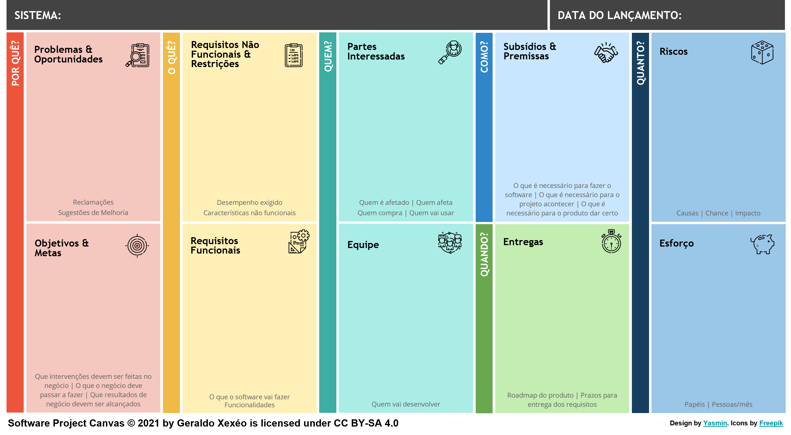

# Software Project Canvas

O  _**Software Project Canvas**_ é uma ferramenta ágil que facilita a colaboração das partes interessadas na  discussão e definição inicial de um projeto de software.

Para a sua  criação foram observadas 7 dificuldades  ao ensinar ou utilizar o _Project Model Canvas_ no contexto de projetos de software.

As modificações feitas visam facilitar a explicação e o uso de um canvas no planejamento inicial de um projeto de desenvolvimento de software, além de evitar perda de tempo, durante a reunião de concepção do projeto, com discussões semânticas sobre o significado das coisas que não adiantam a definição do projeto.

Maiores explicações podem ser obtidas no [relatório que o explica](softwareprojectcanvas.pdf).

Os canvas original e duas variações possíveis, em formato A4, [podem ser encontrados aqui](dist/Software%20Project%20Canvas%20v1.0.pdf).

Software Project Canvas © 2021 by Geraldo Xexéo está licensiado como CC BY-SA 4.0

